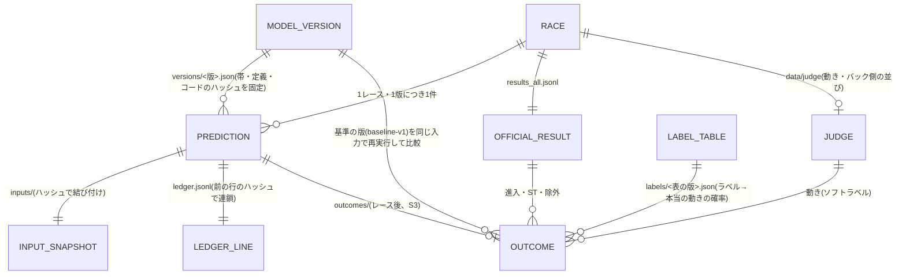

# 予測記録の形式(S1)

作成: 2026-10-07(スレッド「予測記録の形式づくり」)。状態: **形式と仕組みは完成・試験済み。本番の記録はまだ作っていない**(本番には毎日の自動実行と、push 先の専用公開リポジトリの作成が要る。9章)。
上位の資料: `DESIGN_prediction_verification.md` 第2章・5.1・5.3・5.4、`GATE_stage2to3_20261007.md`。食い違ったら上位の資料が正しい。

| ファイル | 中身 |
|---|---|
| `predrec.py` | 記録の作成(make)・検証(verify)・コミット(commit)。評価で使う共通計算(Brier・想定外の tail・ST の z)もここに置いた |
| `schema/prediction.schema.json` | 予測記録の形式(JSON Schema draft-07) |
| `schema/model_version.schema.json` | 版の設定の形式 |
| `schema/outcome.schema.json` | レース後の照合結果の形式(**案**。S3 の評価器で確定する) |
| `versions/trial-v0.json`、`models/trial_v0.py` | 動作確認用の版(全レース同じ起点の確率)。**判定には使わない** |
| `examples/` | 実データ(大村 2026-09-10 1R)で作った記録の例(バックテスト扱い) |
| `tests/test_predrec.py` | 確認用テスト 35件 |
| `.gitattributes` | 改行を LF に固定(Windows で台帳の改行が混ざらないように) |

---

## 1. 目的(サービスへの貢献)

1. 予測を**締切前に、後から書き換えられない形で**残す。サイトの「予想履歴(外れ込み)」と段階2の公開検証の土台になる。
2. 外れたときに外れ方(E1〜E4)を分けられるよう、最終的な予測だけでなく**前提(進入・ST・足の評価)**も残す。
3. 段階2→3 の判定(GATE の条件1〜3)を、記録だけから機械的に計算できるようにする。

## 2. 必要なデータ

| データ | 出どころ | 記録での扱い |
|---|---|---|
| 入力一式(出走表・直前情報・オリジナル展示・オッズ・気象) | 本番: 予測時点で公式サイトから取得。試験: `kyotei_mark1/data/aux.jsonl` | `inputs/` にそのまま保存し、ハッシュを記録に書く |
| モデルの出力 | 版の `entry`(`predict(snapshot)` を持つファイル) | 起点7分類の確率・前提・艇ごとの確率・根拠 |
| 版の設定 | `versions/<版>.json` | 設定ファイルのハッシュとコードのハッシュを記録に書く |
| 締切予定時刻 | 公式サイトの出走表 | `race.deadline`(本番では必須) |

## 3. 記録の中身(1レース・1版につき1件)

| 項目 | 内容 | 使い道 |
|---|---|---|
| `mode` | `live`(締切前の本番)/`backtest`(過去レースでの試し) | 判定に数えるのは `live` だけ(GATE 第8章4) |
| `race` | レースID(`24_YYYYMMDD_RR`、大村以外は拒否)・締切時刻とその出どころ | 後出しでないことの確認 |
| `created_at` | 作った時刻 | 同上(限界は4章) |
| `model` | 版・版の設定のハッシュ・コードのハッシュ・コードの git コミット(自動)・出力の出どころ(モデル実行/手で用意)・predrec.py のハッシュ | 版ごとの成績比較、版の途中変更の検出 |
| `input` | 入力のハッシュ・保存先・取得時刻 | 再現・改ざん検出 |
| `premise.entry` | 予想進入(コース1〜6に入る艇番)と、その確率(任意) | E1 |
| `premise.st` | 各艇の ST の予測分布(平均と sd、秒)。出さないモデルは null | E2(\|実ST−平均\|/sd > 1.96) |
| `premise.form` | 足の評価 上/中/下(任意) | 参考表示のみ(設計書5.1) |
| `origin` | 起点7分類の確率(2まくり・3まくり・4まくり・5まくり・6まくり・3まくり差し・その他の順、合計1) | GATE 条件1・2 |
| `main_scenario` | 起点の確率が最大のものとその確率、アニメ用パターンID(任意) | 見出し・アニメ・自信度 |
| `confidence` | ◎○△ と、使った帯(版の設定と同じ値) | GATE 条件3 |
| `boats` | 2〜6号艇の、試みる動きの確率と、試みたときの成功確率 | E3・E4 |
| `boat1` | 1号艇の攻められ方の確率と逃げ切り確率 | 1号艇の別扱い |
| `rationale` | 根拠(特徴・値・どの予測を上げ下げしたか) | 根拠の文章 |
| `integrity.record_hash` | この項目を除いた記録のハッシュ | 改ざん検出 |

機械的に決まる項目(主シナリオ・自信度・ハッシュ・作成時刻)は `predrec.py` が計算し、手で書けない。確率は小数6桁に丸めて記録する(同率の判定を安定させるため)。

**本番(live)の決まり**: 締切時刻は日本時間(+09:00)で必須、時刻の順は「入力の取得 ≤ 作成 < 締切」、版を固定した後に作成、版のモデルを実行した出力だけ(手で用意した出力は試しでだけ使える)、モデルのコードが git にコミット済み。モデルの `predict(snapshot)` は同じ入力なら同じ出力を返すこと(verify が実行し直して記録と比べる)。

**自信度**: 主シナリオ確率 $p$ について、版の帯 $(\mathrm{lo}, \mathrm{hi})$ を使い、$p \ge \mathrm{hi}$ なら◎、$p < \mathrm{lo}$ なら△、それ以外は○。帯は版を作るときに構築期間の主シナリオ確率の3分位で決め、版の中では変えない(GATE 第5章)。

**想定外の同率の按分**: 設計書5.4の「同率は乱数で按分」の乱数 $u$ は、記録のハッシュとレース後の公式結果(着順・決まり手・ST)をつないだもののハッシュから決める(先頭64ビット ÷ $2^{64}$)。記録の時点では結果が分からないので、作る側が記録の中身を変えて都合の良い $u$ を選ぶことはできない(記録のハッシュだけから決める案は、根拠の文を変えて何度も作り直せば狙えることを点検で確認したため変えた)。

## 4. 改ざん防止の仕組みと限界

| ごまかし方 | 防ぎ方 | 確認 |
|---|---|---|
| 締切後に作って締切前と言い張る | 本番は締切後の作成を拒否。**締切前に GitHub へ push** する | verify が「最初のコミットが締切後」「締切を過ぎても未コミット」を出す |
| 記録した後で中身を直す | 記録のハッシュ、入力のハッシュ、git で追加後に変更が無いこと、モデルを実行し直して同じ予測になること | verify(テストで確認済み) |
| 手で作った予測を版の名前で記録する | 本番は版のモデルの実行だけ。コードのハッシュと git コミットを記録 | make が拒否、verify が再実行で検出 |
| 都合の悪い記録を消す・並べ替える | 台帳 `ledger.jsonl` の各行が前の行のハッシュを持つ(連鎖)。git の履歴で台帳が追記だけか、記録・入力が消されていないか | verify が連番の飛び・連鎖の切れ・台帳に無いファイル・履歴上の書き換えや削除を出す。**公開リポジトリでは force-push を禁止する設定が要る**(履歴ごと作り直されると手元の検査では分からない) |
| 同じレースに複数の予測を置く(両張り) | 1レース1版1件。台帳の行と記録の中身(レース・版)を突き合わせる | verify。**版を複数並行させる両張りは、判定に数える版を1つに決め、その版の設定を `eval_from` より前に push しておく決まりで防ぐ**(S3 の集計で確かめる) |
| 版の途中で帯や定義をこっそり変える | 記録に版の設定のハッシュ、作成時にコードのハッシュを照合 | make が拒否、verify が検出 |
| 自信のあるレースだけ記録する | 版の対象を「大村の全レース」とし、集計で記録漏れの率を出す(S3) | S3 で実装 |

**限界(重要)**: 作成時刻もコミット時刻も PC の時計で書かれるので、PC の時計を戻せば偽装できます(点検で確認)。第三者に示せる証拠になるのは **GitHub に push が届いた時刻**です。したがって「締切前に push まで終える」ことが必須で、ローカルのコミットだけでは証明になりません。さらに強くするなら、公開のタイムスタンプ局(RFC 3161)の印を台帳に付ける方法があります(未実装・未検証)。

## 5. 段階2→3 の判定(GATE)との対応

| GATE の条件 | 使う項目 |
|---|---|
| 判定に数える記録 | `mode = live`、版の `eval_from` 以降、実際の進入が枠なりで除外なし(照合結果側で判断) |
| 条件1 Brierスキルスコア | `origin.p`(基準モデルの記録も同じ形で作り、同じレースで比べる) |
| 条件2 想定外 | `origin.p` と記録のハッシュから決まる $u$ |
| 条件3 自信度 | `confidence.mark`・`main_scenario.p`・帯 |
| 版の固定・数え直し | `model.version`・`model.manifest_hash` |

## 6. 外れ分類(設計書5.1)との対応

E0 は照合結果(公式結果の除外・ラベル確信度)から決まる。E1 は `premise.entry`、E2 は `premise.st`、E3 は `boats[].move_p`、E4 は `boats[].success_p` と版の `success_definition` で判定する。予測を出していない項目(null)の分類は「判定なし」にする。

## 7. データの関係(ER図)



## 8. 使い方

```
python predrec.py make --root . --race 24_20261010_05 --deadline 2026-10-10T12:41:00+09:00 --version <版> --input <入力.json>
python predrec.py verify --root .
python predrec.py commit --root .      # git のコミットだけ。push は別(ユーザーの了承後)
python evaluate.py report --root . --version <版> --base-version baseline-v1 --results <results.jsonl> --judge <judge.json> --out report.json   # レース後の評価(S3)
python -m unittest discover -s tests   # 確認用テスト
```

置き場所: 記録は `records/24/<日付>/<レースID>__<版>.json`、入力は `inputs/24/<日付>/<レースID>__<版>.input.json`。新しい版は `versions/` に設定を足し、`code_files_hash` を `predrec.code_files_hash()` で計算して書く。

## 9. 確認したこと・未決の点

**確認したこと**
- テスト35件が通る(Python 3.13・jsonschema 4.26 と、このPCの作業環境と同じ Python 3.10・jsonschema 3.2 の両方)。確認内容: 主シナリオと自信度の自動計算、大村以外・締切後・日本時間でない締切・確率の合計違い・コード変更・版の設定変更・本番での手作りの出力・git 無しの本番の拒否、記録や入力の書き換え・ハッシュを計算し直した書き換え・台帳の行の抜き取り・両張り・コミット後の変更・コミット済み記録の削除・締切後コミット・締切後も未コミットの検出、改行コード(CRLF)の違いで同じハッシュになること、整数キーの入力、設計書5.4の tail の例(まくり10%・まくり差し40%)、0.1+0.2 と 0.3 を同率に扱うこと。
- 別のサブエージェントに弱点を点検させ、見つかった16点(jsonschema 3.2 でスキーマの参照が解決できずに止まる不具合、時刻を指定できる・手作りの出力が通る・削除が分からないなどの抜け道)を直した。直せないもの(PC の時計の偽装、force-push)は上の表に書いた。
- 実データ1レース(`examples/`)で記録を作り、verify が通ること。

**未決・要判断**
1. **push 先のリポジトリ**: 2026-10-07 ユーザー決定で「予測記録専用の公開リポジトリ」https://github.com/harukishimizu2020-sketch/boat-predictions 。同日に初回 push 済み、main は削除と force-push を禁止済み(ルール protect-main)。git は Windows の git で行う(Claude の作業環境はこのフォルダのファイルを消せないため git の一時ファイルが残り、git を使えない)。手順は `PUSH_STEPS.md`(共有フォルダ側)。
2. **本番の毎日の実行**: 締切前に「入力取得 → 予測 → 記録 → push」を毎レース行う仕組みは、毎日の自動運用を作らない現方針(PROJECT_BOARD 1.2)により未作成。締切時刻と直前情報の取得は Windows 側(既存の `kyotei_mark1/pipeline/*.mjs` と同じ方法)で行う必要がある(このPCの作業環境・クラウドからは公式サイトに接続できなかった)。
3. **攻めの成功(E4)と逃げ切りの定義**: 版の設定に書く欄だけ用意した(未定)。バック側の並びの精度確認の後に決める。
4. **E0 と E1 の関係**: 設計書では進入変更レースを E0(対象外)に入れているため、枠なりを予想する限り E1 は起きない。E1 を数えたい場合は設計書5.1の見直しが要る。
5. **オッズの時刻**: `aux.jsonl` のオッズは取得時刻が分からず、確定オッズなら過去レースでの試しに使うと先読みになる。本番では予測時点のオッズを入力として保存する。

## 10. 評価器と基準モデル(S3、2026-10-07)

評価器 `evaluate.py`、正解ラベルの表 `labels/soft-v1.json`、基準モデル `baseline-v1`(`models/baseline_v1.py`・`versions/baseline-v1.json`)、作成用の道具 `tools/`(基準の作成 `build_baseline.py`、試しの記録 `backtest.py`、想定外の数え方の模擬計算 `sim_unexpected.py`)を追加した。過去レース(大村 2026-09-01〜10-01、数える 176 件)で試した結果、確認したこと、評価の数え方2点(2026-10-07 ユーザー決定: 段階2→3の条件2「想定外」はソフト正解の期待件数で数える、確信度「低」のラベルも主集計に含める)は `S3_REPORT.md` にまとめた。
